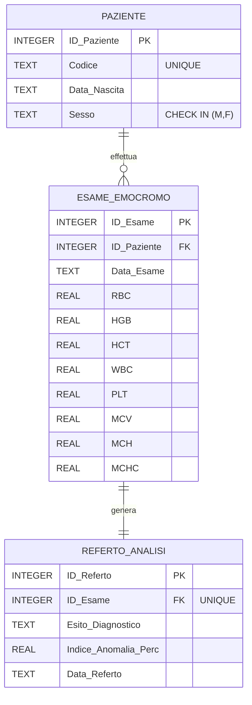

# EmocromoAnalyzer - Gestione & Analisi Emocromo

**EmocromoAnalyzer** è un'applicazione desktop sviluppata in MATLAB App Designer integrata con un database relazionale SQLite. L'obiettivo del progetto è automatizzare l'analisi dei parametri ematologici (emocromo) e fornire diagnosi automatica di anomalie.

---

## Indice

1. [Funzionalità Principali](#funzionalità-principali)
2. [Requisiti e Setup](#requisiti-e-setup)
3. [Guida di Avvio](#guida-di-avvio)
4. [Architettura del Database](#architettura-del-database)
5. [Struttura del Progetto](#struttura-del-progetto)
6. [Descrizione Clinica dei Parametri](#descrizione-clinica-dei-parametri)
7. [Algoritmi Diagnostici](#algoritmi-diagnostici)
8. [Troubleshooting](#troubleshooting)
9. [Background Scientifico](#background-scientifico)

---

## Funzionalità Principali

- **Input Parametri Clinici**: Inserimento e validazione di parametri ematologici (Sesso, HGB, RBC, WBC, PLT, MCV, MCH, MCHC)
- **Diagnosi Automatica**: Rilevamento in tempo reale di anomalie (Anemia Microcitica/Normocitica, Piastrinopenia, Anomalia Leucocitaria)
- **Visualizzazione Grafica**: Grafico a barre interattivo su UIAxes con normalizzazione percentuale e linea di riferimento al 100%
- **Database Relazionale**: Integrazione SQLite con 3 tabelle collegate tramite chiavi esterne
- **Storico Dinamico**: Visualizzazione tabellare degli ultimi pazienti con query LEFT JOIN e gestione valori nulli
- **Gestione Pazienti**: Codice paziente univoco, data di nascita, storico esami

---

## Requisiti e Setup

### Software Necessario

| Requisito | Versione | Note |
|-----------|----------|------|
| MATLAB | R2020b o successiva | Richiesto |
| Database Toolbox | - | Supporto nativo `sqlite` |
| VS Code | - | Opzionale (per gestire il repo e il CSV) |

### Step 1: Clona il Repository

```bash
git clone https://github.com/nicollette26/progetto.git
cd progetto
```

### Step 2: Verifica i File Necessari

Assicurati di avere questi file nella cartella del progetto:

- `crea_database.m` - Script per creare lo schema SQLite
- `popola_database.m` - Script per popolare il DB dal CSV
- `blood_count_dataset.csv` - Dataset con i dati dei pazienti
- `EmocromoAnalyzer.mlapp` - Applicazione App Designer

---

## Guida di Avvio

### Procedura Standard

Apri MATLAB nella cartella del progetto e segui questi passaggi in ordine:

#### 1️. **Crea il Database**

Digita nel Command Window di MATLAB:

```matlab
crea_database
```

**Output atteso:**
```
----------------------------------------------------
 Database "emocromo.db" creato con successo! 
----------------------------------------------------
```

Se vedi un errore, vai alla sezione [Troubleshooting](#troubleshooting).

#### 2️. **Popola il Database dal CSV**

Digita:

```matlab
popola_database
```

**Output atteso:**
```
Database pulito. Inizio inserimento dei dati...
----------------------------------------------------
 Database popolato correttamente senza valori NULL! 
----------------------------------------------------
```

> **Importante**: Il file `blood_count_dataset.csv` deve trovarsi nella stessa cartella di `popola_database.m`. Controlla che le colonne del CSV siano esattamente:
> - `Age`, `Gender`, `Hemoglobin`, `Red_Blood_Cells`, `White_Blood_Cells`, `Platelet_Count`, `MCV`, `MCH`, `MCHC`

#### 3️. **Avvia l'Applicazione**

Digita:

```matlab
appdesigner EmocromoAnalyzer.mlapp
```

L'app si apre in MATLAB App Designer. Clicca il pulsante **▶ Run** (in alto) per eseguire l'applicazione.

---

## Architettura del Database

Il database SQLite (`emocromo.db`) è composto da **3 tabelle relazionali**:

### Tabella PAZIENTE
```
ID_Paziente (PK, AUTOINCREMENT)
├─ Codice (VARCHAR, UNIQUE) - Identificativo univoco (es. PAZ_001)
├─ Data_Nascita (DATE) - Anno di nascita approssimativo
└─ Sesso (CHAR, CHECK IN ('M', 'F'))
```

### Tabella ESAME_EMOCROMO
```
ID_Esame (PK, AUTOINCREMENT)
├─ ID_Paziente (FK) → PAZIENTE(ID_Paziente)
├─ Data_Esame (DATE, DEFAULT CURRENT_DATE)
├─ RBC, HGB, HCT, WBC, PLT (REAL) - Parametri ematologici
└─ MCV, MCH, MCHC (REAL) - Indici eritrocitari
```

### Tabella REFERTO_ANALISI
```
ID_Referto (PK, AUTOINCREMENT)
├─ ID_Esame (FK, UNIQUE) → ESAME_EMOCROMO(ID_Esame)
├─ Esito_Diagnostico (TEXT) - Es. "Anemia Microcitica"
├─ Indice_Anomalia_Perc (REAL) - Gravità 0-100%
└─ Data_Referto (DATE, DEFAULT CURRENT_DATE)
```

### Diagramma ER (Entity Relationship)



---

## Struttura del Progetto

```
progetto/
├── README.md                      # Questo file
├── crea_database.m                # Script creazione schema DB
├── popola_database.m              # Script popolo DB da CSV
├── EmocromoAnalyzer.mlapp         # App Designer (interfaccia grafica)
├── blood_count_dataset.csv        # Dataset con dati pazienti
└── emocromo.db                    # Database SQLite (creato in runtime)
```

### File Descrizione

| File | Tipo | Scopo |
|------|------|-------|
| `crea_database.m` | MATLAB Script | Crea tabelle SQLite con indici |
| `popola_database.m` | MATLAB Script | Legge CSV e inserisce dati nel DB |
| `EmocromoAnalyzer.mlapp` | App Designer | Interfaccia grafica + logica applicativa |
| `blood_count_dataset.csv` | Dataset | Dati paziente con parametri ematologici |
| `emocromo.db` | SQLite Database | Database relazionale (generato automaticamente) |

---

## Descrizione Clinica dei Parametri

### Globuli Rossi e Trasporto di Ossigeno

**HGB (Emoglobina)** [g/dL]
- Proteina nei globuli rossi che trasporta ossigeno dai polmoni ai tessuti
- Valori normali: Donne 12-16 g/dL | Uomini 13.5-17.5 g/dL
- Basso = Anemia → Meno ossigeno ai tessuti

**RBC (Globuli Rossi / Eritrociti)** [10⁶/μL]
- Numero totale di globuli rossi
- Responsabili del trasporto di O₂ e CO₂
- Valori normali: Donne 4.0-5.2 | Uomini 4.5-5.9

**HCT (Ematocrito)** [%]
- Percentuale di sangue occupata da globuli rossi
- Valori normali: Donne 36-46% | Uomini 41-53%
- Calcolato automaticamente: HCT = RBC × 3.1

### Globuli Bianchi (Sistema Immunitario)

**WBC (Globuli Bianchi / Leucociti)** [10³/μL]
- Numero totale di cellule immunitarie nel sangue
- Difendono da infezioni (batteriche, virali, fungine)
- Valori normali: 4,000 - 11,000 leucociti/μL
- Alto/Basso = Sospetta infezione, infiammazione o immunodeficienza

### Piastrine (Coagulazione)

**PLT (Piastrine / Trombociti)** [10³/μL]
- Cellule fondamentali per la coagulazione del sangue
- Riparano vasi sanguigni in caso di ferite
- Valori normali: 150,000 - 400,000 piastrine/μL
- Basso = Piastrinopenia → Rischio emorragie

### Indici Eritrocitari (Qualità Globuli Rossi)

**MCV (Volume Corpuscolare Medio)** [fL]
- Misura la dimensione media dei globuli rossi
- Valori normali: 80 - 100 fL
- Basso (< 80) = Globuli rossi piccoli (Microcitica)
- Alto (> 100) = Globuli rossi grandi (Macrocitica)

**MCH (Emoglobina Corpuscolare Media)** [pg]
- Quantità media di emoglobina per globulo rosso
- Valori normali: 27 - 33 pg
- Riflette il contenuto di ossigeno trasportabile

**MCHC (Concentrazione Emoglobina Corpuscolare Media)** [g/dL]
- Concentrazione media di emoglobina nei globuli rossi
- Valori normali: 32 - 36 g/dL
- Poco variabile, importante per diagnostica

---

## Algoritmi Diagnostici

L'app implementa logica diagnostica basata su soglie cliniche consolidate:

### 1. **Anemia**

```
SE (Sesso == 'F' AND HGB < 12.0) OR (Sesso == 'M' AND HGB < 13.5) ALLORA
    SE MCV < 80 ALLORA
        Esito = "Anemia Microcitica"
        Indice_Anomalia = 25%
    ALTRIMENTI
        Esito = "Anemia Normocitica"
        Indice_Anomalia = 25%
```

**Cause comuni:**
- Carenza ferro, B12, acido folico
- Emorragia
- Malattie croniche

### 2. **Anomalia Leucocitaria (WBC)**

```
SE (WBC > 11,000) OR (WBC < 4,000) ALLORA
    Esito = "Anomalia Globuli Bianchi"
    Indice_Anomalia = 30%
```

**Interpretazione:**
- WBC alto → Infezione acuta, leucemia, infiammazione
- WBC basso → Immunodeficienza, chemioterapia, lupus

### 3. **Piastrinopenia**

```
SE PLT < 150,000 ALLORA
    Esito = "Piastrinopenia"
    Indice_Anomalia = 20%
```

**Cause:**
- Consumo aumentato (DIC, ITP)
- Produzione ridotta (aplasia midollare)
- Malattie autoimmuni

### 4. **Valori nella Norma**

```
SE nessuna condizione sopra ALLORA
    Esito = "Valori nella Norma"
    Indice_Anomalia = 0%
```

---

## Troubleshooting

### Errore 1: "File blood_count_dataset.csv non trovato"

**Causa:** Il CSV non è nella stessa cartella di `popola_database.m`

**Soluzione:**
```matlab
% In MATLAB, verifica la cartella corrente
pwd  % stampa il percorso attuale
cd /percorso/corretto/  % cambia cartella
ls   % elenca i file (su Linux/Mac) o dir (su Windows)
```

Assicurati che `blood_count_dataset.csv` sia visibile.

---

### Errore 2: "Subscripting into a table using one subscript ... is not supported"

**Causa:** Accesso scorretto alle colonne di una table MATLAB

**Soluzione:** Questo errore è stato già corretto in `popola_database.m`. Se persiste:
```matlab
% Sbagliato ❌
eta = dataset.Age(i);

% Corretto ✅
eta = dataset{i, 'Age'};
```

---

### Errore 3: "FOREIGN KEY constraint failed"

**Causa:** L'ID_Paziente o ID_Esame non esiste nella tabella padre

**Soluzione:** Esegui di nuovo i comandi in ordine:
```matlab
clear all
crea_database
popola_database
```

Se persiste, elimina il file `emocromo.db` e ricrea da zero.

---

### Errore 4: "Database is locked"

**Causa:** Un'altra connessione SQLite ha il DB aperto

**Soluzione:**
```matlab
clear all  % Chiude tutte le connessioni
close all
```

Se usi VS Code con estensione SQLite, chiudi eventuali query aperte.

---

### Errore 5: App Designer non si apre

**Causa:** MATLAB non ha trovato il file `.mlapp`

**Soluzione:**
```matlab
% Verifica il percorso
which EmocromoAnalyzer.mlapp

% Se non lo trova, cambia directory
cd /percorso/progetto
appdesigner EmocromoAnalyzer.mlapp
```

---

## Background Scientifico

### Contesto Clinico

L'emocromo (Esame Emocromocitometrico Completo) è uno dei test diagnostici più comuni nella medicina moderna. L'analisi automatizzata dei parametri ematologici è fondamentale per:

1. **Diagnosi differenziale rapida** di anemie, infezioni e disordini emorragici
2. **Monitoring** di pazienti in terapia (chemioterapia, immunoterapia)
3. **Risk stratification** in pazienti critici

### Dataset: Kaggle

Per reperire i dati necessari allo sviluppo del progetto, ho consultato il sito **Kaggle** (https://www.kaggle.com/datasets), una delle piattaforme più importanti per la raccolta di dataset pubblici. In particolare qui ho trovato il dataset utilizzato per il progetto, selezionando un insieme di dati ematologici strutturati e pertinenti all'analisi dell'emocromo

---

### Riferimento 1: COVID-19 e Alterazioni Ematologiche

Uno studio pubblicato su **PubMed Central** ha analizzato come il COVID-19 provoca alterazioni significative dell'emocromo, in particolare:

- **Linfopenia** (basso numero di linfociti) correlata con decorso grave
- **Leucocitosi** (aumento leucociti) come marker di gravità
- **Trombocitopenia** associata a outcome peggiori

**Citazione:**
> "Low lymphocyte count might be used by clinicians in risk stratification to predict severe and fatal COVID-19 outcomes"

**Fonte:** 
- "Complete blood count alterations in COVID-19 patients" 
- https://pmc.ncbi.nlm.nih.gov/articles/PMC8495616/

### Riferimento 2: Senescenza Cellulare e Ematopoiesi

Uno studio recente del **National Center for Biotechnology Information (NCBI)** ha dimostrato che:

- L'eliminazione farmacologica delle **cellule senescenti** attenua l'invecchiamento del midollo osseo
- La disfunzione nucleolare causa alterazioni nei parametri ematologici
- La risposta immunitaria innata è compromessa in condizioni di senescenza

**Fonte:**
- "Nucleolar dysfunction-mediated leakage of DNA-RNA hybrids primes the innate immune response..."
- https://www.ncbi.nlm.nih.gov/

---

## Autore e Note di Sviluppo

- **Progetto:** Elaborato Biomedico
- **Linguaggio:** MATLAB (App Designer + SQLite)
